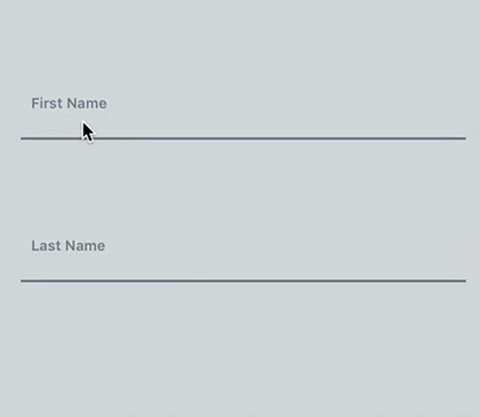
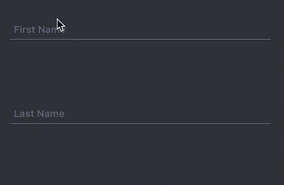

## TextFieldEffects

[](https://github.com/Cokile/CCTextFieldEffects/blob/master/Licence)
[](https://github.com/Cokile/CCTextFieldEffects/releases)

Custom UITextFields effects inspired by [Codrops](http://tympanus.net/Development/TextInputEffects/index.html), built using Swift, but ported to Objective-C.

It now support

- [x] [Akira](https://github.com/Cokile/CCTextFieldEffects#akira)
- [x] [Hoshi](https://github.com/Cokile/CCTextFieldEffects#hoshi)
- [x] [Isao](https://github.com/Cokile/CCTextFieldEffects#isao)
- [x] [Jiro](https://github.com/Cokile/CCTextFieldEffects#jiro)
- [x] [Kaede](https://github.com/Cokile/CCTextFieldEffects#kaede)
- [x] [Madoka](https://github.com/Cokile/CCTextFieldEffects#madoka)
- [x] [Yoko](https://github.com/Cokile/CCTextFieldEffects#yoko)
- [x] [Yoshiko](https://github.com/Cokile/CCTextFieldEffects#yoshiko)


## Installation

### CocoaPods

Simply add one line to your Podfile:
```ruby
pod 'CCTextFieldEffects'
```

### Manual

Drag all the files in the  `CCTextFieldEffects` folder into your project.


## Easy to use

### Akira


```objective-c
#import "CCTextFieldEffects.h"

//...
@property (strong, nonatomic) AkiraTextField *akiraTextField;

//...
self.akiraTextField = [[AkiraTextField alloc] initWithFrame:<#CGRect#>];

// The size of the placeholder label relative to the font size of the text field, default value is 0.7
self.akiraTextField.placeholderFontScale = <#CGFloat#>;

// The color of the border, default value is R105 G106 B110 
self.akiraTextField.borderColor = <#UIColor#>;

// The color of the placeholder, default value is R204 G96 B85
self.akiraTextField.placeholderColor = <#UIColor#>;

// The color of the cursor, default value is R170 G170 B170
self.akiraTextField.cursorColor = <#UIColor#>;

// The color of the text, default value is R170 G170 B170
self.akiraTextField.textColor = <#UIColor#>;

// The block excuted when the animation has completed.
self.akiraTextField.animationCompletionHandler = ^(CCAnimationType type){
	if (type == CCAnimationTypeTextEntry) {
  		// The code excuted when the animation has obtained focus has completed.
      	// ...
	}
  
  	if (type == CCAnimationTypeTextEntry) {
  		// The code excuted when the animation for losed focus has completed.
      	// ...
	}
};

[self.view addSubview:self.akiraTextView];
```


### Hoshi


```objective-c
#import "CCTextFieldEffects.h"

//...
@property (strong, nonatomic) HoshiTextField *hoshiTextField;

//...
self.hoshiTextField = [[HoshiTextField alloc] initWithFrame:<#CGRect#>];

// The size of the placeholder label relative to the font size of the text field, default value is 0.65
self.hoshiTextField.placeholderFontScale = <#CGFloat#>;

// The color of the inactive border, default value is R185 G193 B202 
self.hoshiTextField.borderInactiveColor = <#UIColor#>;

// The color of the active border, default value is R106 B121 B137
self.hoshiTextField.borderActiveColor = <#UIColor#>;

// The color of the placeholder, default value is R185 G193 B202
self.hoshiTextField.placeholderColor = <#UIColor#>;

// The color of the cursor, default value is R89 G95 B110
self.hoshiTextField.cursorColor = <#UIColor#>;

// The color of the text, default value is R71 G76 B91
self.hoshiTextField.textColor = <#UIColor#>;

// The block excuted when the animation has completed.
self.hoshiTextField.animationCompletionHandler = ^(CCAnimationType type){
	if (type == CCAnimationTypeTextEntry) {
  		// The code excuted when the animation has obtained focus has completed.
      	// ...
	}
  
  	if (type == CCAnimationTypeTextEntry) {
  		// The code excuted when the animation for losed focus has completed.
      	// ...
	}
};

[self.view addSubview:self.hoshiTextField];
```


### Isao


```objective-c
#import "CCTextFieldEffects.h"

//...
@property (strong, nonatomic) IsaoTextField *isaoTextField;

//...
self.isaoTextField = [[IsaoTextField alloc] initWithFrame:<#CGRect#>];

// The size of the placeholder label relative to the font size of the text field, default value is 0.7
self.isaoTextField.placeholderFontScale = <#CGFloat#>;

// The color of the inactive color, default value is R218 G218 B218 
self.isaoTextField.inactiveColor = <#UIColor#>;

// The color of the active color, default value is R218 G112 B113
self.isaoTextField.activeColor = <#UIColor#>;

// The color of the cursor, default value is R175 G179 B184
self.isaoTextField.cursorColor = <#UIColor#>;

// The color of the text, default value is R175 G179 B184
self.isaoTextField.textColor = <#UIColor#>;

// The block excuted when the animation has completed.
self.isaoTextField.animationCompletionHandler = ^(CCAnimationType type){
	if (type == CCAnimationTypeTextEntry) {
  		// The code excuted when the animation has obtained focus has completed.
      	// ...
	}
  
  	if (type == CCAnimationTypeTextEntry) {
  		// The code excuted when the animation for losed focus has completed.
      	// ...
	}
};

[self.view addSubview:self.isaoTextField];
```


### Jiro



```objective-c
#import "CCTextFieldEffects.h"

//...
@property (strong, nonatomic) JiroTextField *jiroTextField;

//...
self.jiroTextField = [[JiroTextField alloc] initWithFrame:<#CGRect#>];

// The size of the placeholder label relative to the font size of the text field, default value is 0.65
self.jiroTextField.placeholderFontScale = <#CGFloat#>;

// The color of the border, default value is R106 G121 B137
self.jiroTextField.borderColor = <#UIColor#>;

// The color of the placeholder, default value is R106 G121 B137
self.jiroTextField.placeholderColor = <#UIColor#>;

// The color of the cursor, default value is R211 G226 B226
self.jiroTextField.cursorColor = <#UIColor#>;

// The color of the text, default value is R211 G226 B226
self.jiroTextField.textColor = <#UIColor#>;

// The block excuted when the animation has completed.
self.jiroTextField.animationCompletionHandler = ^(CCAnimationType type){
	if (type == CCAnimationTypeTextEntry) {
  		// The code excuted when the animation has obtained focus has completed.
      	// ...
	}
  
  	if (type == CCAnimationTypeTextEntry) {
  		// The code excuted when the animation for losed focus has completed.
      	// ...
	}
};

[self.view addSubview:self.jiroTextField];
```


### Kaede


```objective-c
#import "CCTextFieldEffects.h"

//...
@property (strong, nonatomic) KaedeTextField *kaedeTextField;

//...
self.kaedeTextField = [[kaedeTextField alloc] initWithFrame:<#CGRect#>];

// The size of the placeholder label relative to the font size of the text field, default value is 0.8
self.kaedeTextField.placeholderFontScale = <#CGFloat#>;

// The color of the foreground, default value is R239 G238 B238
// The background color is clear color.
self.kaedeTextField.foregroundColor = <#UIColor#>;

// The color of the placeholder, default value is R106 G121 B137
self.kaedeTextField.placeholderColor = <#UIColor#>;

// The color of the cursor, default value is R157 G171 B186
self.kaedeTextField.cursorColor = <#UIColor#>;

// The color of the text, default value is R175 G171 B186
self.kaedeTextField.textColor = <#UIColor#>;

// The block excuted when the animation has completed.
self.kaedeTextField.animationCompletionHandler = ^(CCAnimationType type){
	if (type == CCAnimationTypeTextEntry) {
  		// The code excuted when the animation has obtained focus has completed.
      	// ...
	}
  
  	if (type == CCAnimationTypeTextEntry) {
  		// The code excuted when the animation for losed focus has completed.
      	// ...
	}
};

[self.view addSubview:self.kaedeTextField];
```


### Madoka



```objective-c
#import "CCTextFieldEffects.h"

//...
@property (strong, nonatomic) MadokaTextField *madokaTextField;

//...
self.madokaTextField = [[MadokaTextField alloc] initWithFrame:<#CGRect#>];

// The size of the placeholder label relative to the font size of the text field, default value is 0.65
self.madokaTextField.placeholderFontScale = <#CGFloat#>;

// The color of the border, default value is R103 G100 B124 
self.madokaTextField.borderColor = <#UIColor#>;

// The color of the placeholder, default value is R103 G100 B124
self.madokaTextField.placeholderColor = <#UIColor#>;

// The color of the cursor, default value is R103 G100 B124
self.madokaTextField.cursorColor = <#UIColor#>;

// The color of the text, default value is R103 G100 B124
self.madokaTextField.textColor = <#UIColor#>;

// The block excuted when the animation has completed.
self.madokaTextField.animationCompletionHandler = ^(CCAnimationType type){
	if (type == CCAnimationTypeTextEntry) {
  		// The code excuted when the animation has obtained focus has completed.
      	// ...
	}
  
  	if (type == CCAnimationTypeTextEntry) {
  		// The code excuted when the animation for losed focus has completed.
      	// ...
	}
};

[self.view addSubview:self.madokaTextField];
```


### Yoko


```objective-c
#import "CCTextFieldEffects.h"

//...
@property (strong, nonatomic) KaedeTextField *kaedeTextField;

//...
self.kaedeTextField = [[kaedeTextField alloc] initWithFrame:<#CGRect#>];

// The size of the placeholder label relative to the font size of the text field, default value is 0.7
self.kaedeTextField.placeholderFontScale = <#CGFloat#>;

// The color of the foreground, default value is R0 G0 B0
self.kaedeTextField.foregroundColor = <#UIColor#>;

// The color of the placeholder, default value is R176 G175 B64
self.kaedeTextField.placeholderColor = <#UIColor#>;

// The color of the cursor, default value is R245 G245 B245
self.kaedeTextField.cursorColor = <#UIColor#>;

// The color of the text, default value is R245 G245 B245
self.kaedeTextField.textColor = <#UIColor#>;

// The block excuted when the animation has completed.
self.kaedeTextField.animationCompletionHandler = ^(CCAnimationType type){
	if (type == CCAnimationTypeTextEntry) {
  		// The code excuted when the animation has obtained focus has completed.
      	// ...
	}
  
  	if (type == CCAnimationTypeTextEntry) {
  		// The code excuted when the animation for losed focus has completed.
      	// ...
	}
};

[self.view addSubview:self.kaedeTextField];
```


### Yoshiko


```objective-c
#import "CCTextFieldEffects.h"

//...
@property (strong, nonatomic) YoshikoTextField *yoshikoTextField;

//...
self.yoshikoTextField = [[YoshikoTextField alloc] initWithFrame:<#CGRect#>];

// The size of the placeholder label relative to the font size of the text field, default value is 0.7
self.yoshikoTextField.placeholderFontScale = <#CGFloat#>;

// The color of the active border color, default value is R163 G211 B156
self.yoshikoTextField.activeBorderColor = <#UIColor#>;

// The color of the inactive border color, default value is R208 G209 B208
// Also this is color of the inactive bacoground.
self.yoshikoTextField.inactiveBorderColor = <#UIColor#>;

// The color of the placeholder, default value is R176 G175 B64
self.yoshikoTextField.placeholderColor = <#UIColor#>;

// The color of the active background, default value is R249 G247 B246
self.yoshikoTextField.activeBackgroundColor = <#UIColor#>;

// The color of the cursor, default value is R170 G170 B170
self.yoshikoTextField.cursorColor = <#UIColor#>;

// The color of the text, default value is R170 G170 B170
self.yoshikoTextField.textColor = <#UIColor#>;

// The block excuted when the animation has completed.
self.yoshikoTextField.animationCompletionHandler = ^(CCAnimationType type){
	if (type == CCAnimationTypeTextEntry) {
  		// The code excuted when the animation has obtained focus has completed.
      	// ...
	}
  
  	if (type == CCAnimationTypeTextEntry) {
  		// The code excuted when the animation for losed focus has completed.
      	// ...
	}
};

[self.view addSubview:self.yoshikoTextField];
```


__Note:__ If you run the demo app in the simulator, the animation will get blocked. You should run it in the real iOS device for better usage.


## TODO

- More types of effects.


## Acknowledgement

Thanks to original developer Raul Riera, [@raulriera](http://twitter.com/raulriera)

[https://github.com/raulriera/TextFieldEffects](https://github.com/raulriera/TextFieldEffects)

